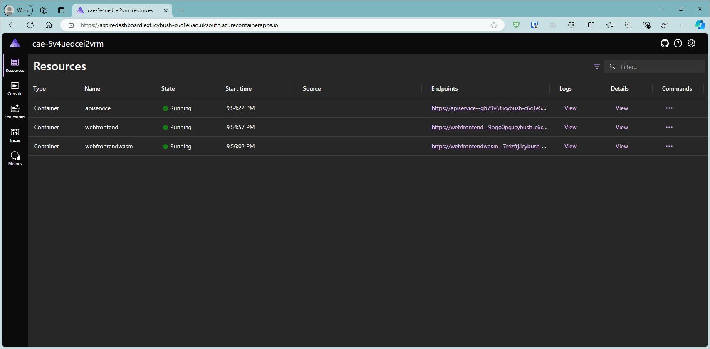

# Aspire-Colors

.NET Aspire is an opinionated, cloud-ready stack for building observable, production-ready, distributed applications.

This project is a .NET Aspire / Blazor version of [ColorsWeb](https://github.com/markharrison/ColorsWeb) & [ColorsAPI](https://github.com/markharrison/ColorsAPI). 


## ColorsX

It includes:

- ColorsX API app ... API includes returning a random color

- ColorsX Web ... displays random light colors driven by calls to API.  Uses Blazor Server. 

- ColorsX WebX ... displays random light colors driven by calls to API.  Uses Blazor WebAssembly. 


## Getting Started

Either clone the repo to desktop or use GitHub CodeSpaces.

Install the aspire workload (sudo may not be required)

```
sudo dotnet workload update
sudo dotnet workload install aspire
sudo dotnet workload list
```

## Azure Developer CLI

You can use the Azure Developer CLI to easily provision Azure Container Apps resources and deploy the application.

Go to route directory - where the solution file is.

```
cd <directory>
``` 

Logon to Azure and initialise Azure Developer CLI to inspect the application.

```
azd auth login
azd init
```


To provision the Azure Container Apps Environment 

```
azd provision
```


To deploy the application to Azure Container Apps 

```
azd deploy
```


The output will give links to 
- ColorsX Web application
- Aspire Dashboard



Use the Azure management portal to see the resources provisioned.


## Ingress for API when using Azure Container Apps 

Behaviour will be different running on a local machine compared to running on Azure Container App - for the latter, the ingress is set to only allow access from traffic originating from within the Azure Container App Environment.

The ColorsX Web app uses Blazor Server - the API calls are from the server within the Azure Container Apps environment.

The ColorsX WebX app uses Blazor WebAssembly - the APIs calls are from the web browser direct to the API url.  To use this, the ingress needs to be amended to allow external access.  Also will need to change the environment variable to point to the new url of the API Service.

Likewise the ingress needs to be amended to view the API Swagger UI.


## Scale up 

You can change the number of lights by amending the Colors URL - append `/{numberoflights}`

Example - for 500 lights

https:// webfrontend.icybush-c6c1e5ad.uksouth.azurecontainerapps.io/colors/500


Use this to drive a high transaction rate.  Notice that the number of replicas of the API App auto-scale up to accommodate the high transaction rate.  it is set to allow between 1 and 10.

## Tidy up 

You can shutdown / delete Azure resources with 

```
azd down
```
